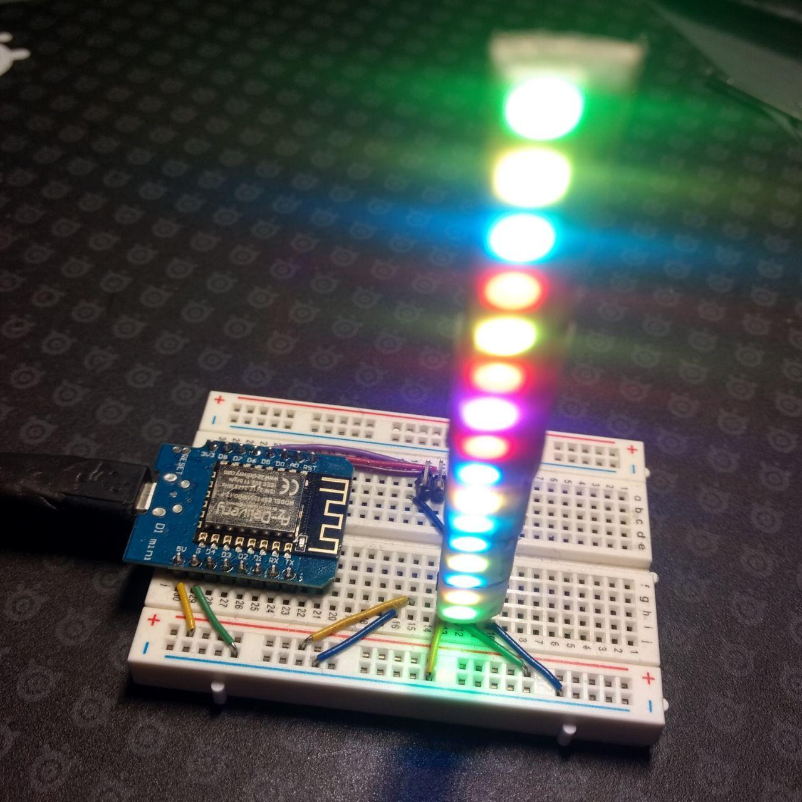
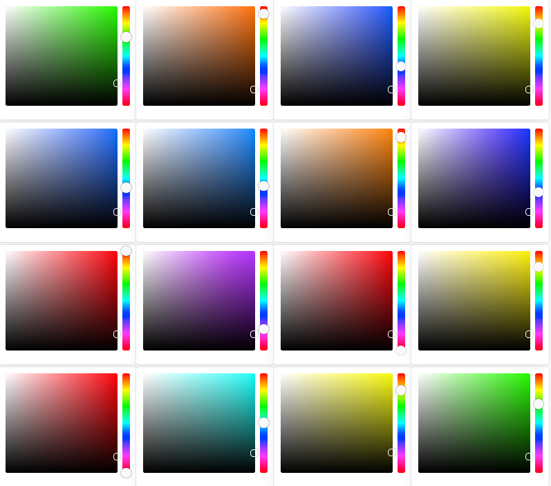

# ESP8266 based webserver to change color of ws2811 LEDs

## chip
My [azdelivery chip](https://www.amazon.de/gp/product/B0754N794H) is to be configured in the Arduino IDE as LoLin(Wemos) D1 R2 & mini

## config
A confg.json must be added inside the `data`-folder with the following content:
``` JSON
{
  "STASSID":"my-ssid",
  "STAPSK":"my-password"
}
```

## Images




## measured power consumption

| State          |  Usage |
| -------------- | ------:|
| Just Step Up   |  144μA |
| Connocting     |  190mA |
| Idle           |  160mA |
| One RGB-LED on |  290mA |
| Two RGB-LED on |  550mA |
| Sleep mode     | *13mA* |

To optimize power consumption [unsolder some chips](https://itooktheredpill.irgendwo.org/2017/reducing-nodemcu-power-consumption/)
